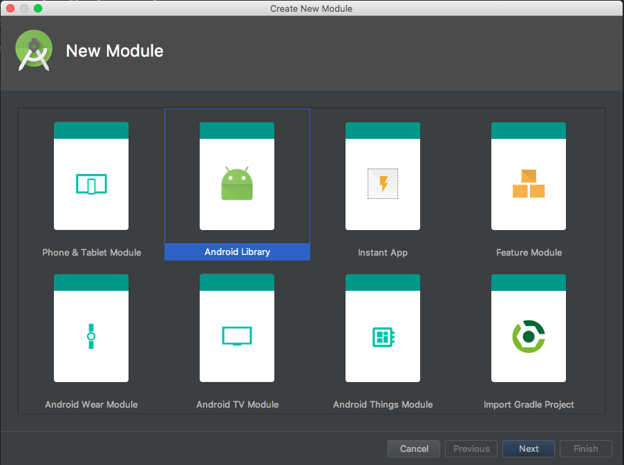
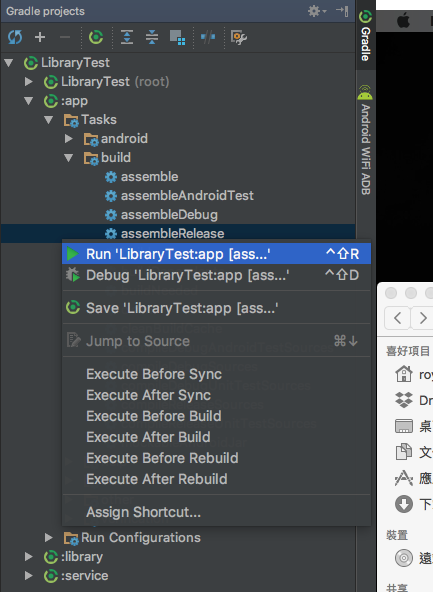
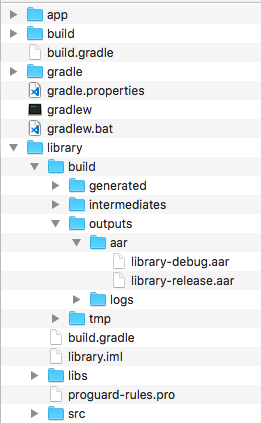

# 透過Android Studio 建立 AAR Library

在 Android Studio 中選擇 File -> New -> New Module 即可看到下圖，並選擇 Android Library。

在新建的 Module 實作完後，再來要產生 AAR 檔，在 Android Studio 右側邊欄選擇 Gradle 並照下圖找到 assembleRelease 滑鼠右鍵 Run後即可。

Run完後即可到資料夾下找aar檔案，位置如下圖。
